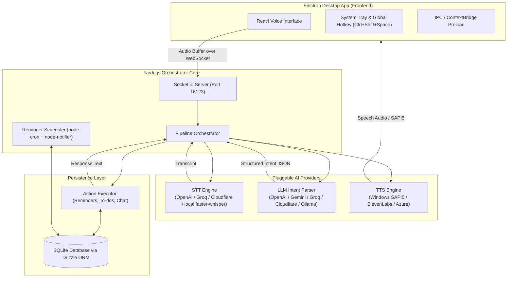
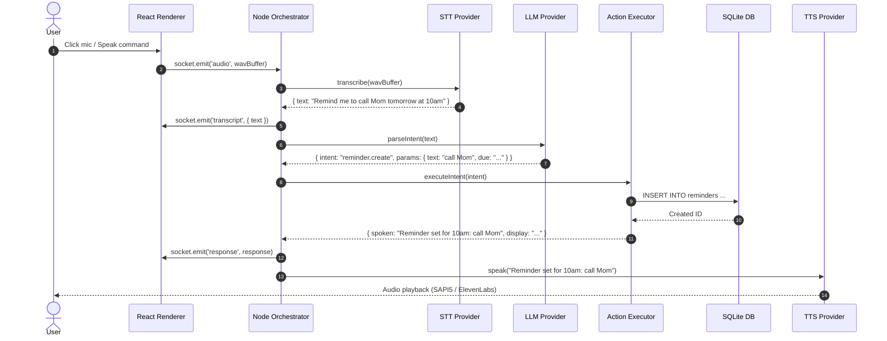

# Saira — System Architecture

**Saira** is a modular, voice-activated Windows desktop assistant designed with Electron, React, TypeScript, SQLite, and a pluggable AI provider architecture (STT, LLM, TTS).

---

## 1. High-Level System Architecture



---

## 2. Core Subsystems

### A. Main Desktop Process & Window Management ([src/main/index.ts](file:///c:/Users/kapil/Desktop/space/saira-assistant/src/main/index.ts))
- **Tray & Global Hotkey**: Registers Windows System Tray icon and `Ctrl+Shift+Space` global shortcut to toggle the floating voice window.
- **IPC Isolation**: Uses Electron `contextBridge` ([src/main/preload.ts](file:///c:/Users/kapil/Desktop/space/saira-assistant/src/main/preload.ts)) to separate secure native Node APIs from the web renderer.

### B. Voice Interface & Renderer ([src/renderer/index.tsx](file:///c:/Users/kapil/Desktop/space/saira-assistant/src/renderer/index.tsx))
- **Audio Capture**: Utilizes browser `navigator.mediaDevices.getUserMedia` and `MediaRecorder` API to record voice input into WAV chunks.
- **WebSocket Streaming**: Streams binary audio data over Socket.io to the orchestrator.

### C. Pipeline Orchestrator ([src/orchestrator/index.ts](file:///c:/Users/kapil/Desktop/space/saira-assistant/src/orchestrator/index.ts))
The central engine that manages the end-to-end pipeline execution:
1. Receives audio buffer from socket.
2. Invokes **STT** provider to convert audio into text (`transcribe`).
3. Passes transcript to **LLM** provider to parse into structured intent (`parseIntent`).
4. Executes the intent via **Action Executor** (`executeIntent`).
5. Invokes **TTS** provider to synthesize speech output (`speak`).

### D. Pluggable Providers ([src/providers/](file:///c:/Users/kapil/Desktop/space/saira-assistant/src/providers))
Each AI task is decoupled into independent provider interfaces with automatic fallback:

| Provider Type | Supported Engines | Automatic Fallback |
|---|---|---|
| **Speech-to-Text (STT)** | OpenAI Whisper, Groq Whisper, Cloudflare Workers AI (`@cf/openai/whisper`), local `faster-whisper` | Local `faster-whisper` server |
| **Intent Model (LLM)** | OpenAI (`gpt-4o-mini`), Google Gemini, Groq (Llama), Cloudflare Workers AI (`@cf/meta/llama-3.1-8b-instruct`), Ollama | Local Ollama (`llama3.1`) |
| **Text-to-Speech (TTS)** | Windows SAPI5 (offline native), ElevenLabs, Azure Neural TTS | Windows SAPI5 (Powershell `System.Speech`) |

### E. Action Executor & Storage ([src/actions/](file:///c:/Users/kapil/Desktop/space/saira-assistant/src/actions) & [src/db/](file:///c:/Users/kapil/Desktop/space/saira-assistant/src/db))
- **Action Executor**: Takes validated intent JSON (e.g. `reminder.create`, `todo.create`, `chat.respond`) and performs the underlying operations.
- **Database**: Local SQLite database using `better-sqlite3` and `drizzle-orm` storing `reminders` and `todos` tables.

### F. Background Scheduler ([src/orchestrator/scheduler.ts](file:///c:/Users/kapil/Desktop/space/saira-assistant/src/orchestrator/scheduler.ts))
- Runs background cron jobs to check for due reminders in SQLite.
- Triggers native Windows desktop notifications via `node-notifier` and speaks alert text via TTS.

---

## 3. End-to-End Voice Request Sequence



---

## 4. Directory Map

```text
saira-assistant/
├── assets/                  # App icons and media assets
├── src/
│   ├── actions/             # Business logic handlers for intents (reminders, todos, chat)
│   ├── db/                  # SQLite schema definitions and Drizzle ORM operations
│   ├── main/                # Electron main process (tray, windows, shortcuts, IPC preload)
│   ├── orchestrator/        # Socket.io pipeline coordinator & cron scheduler
│   ├── providers/           # Decoupled STT, LLM, and TTS provider implementations
│   ├── renderer/            # React user interface components & audio recording hook
│   └── shared/              # Zod config validation, types, and HTTP helpers
├── index.html               # Main HTML entry template
├── tsup.config.ts           # Dual-target build configuration (Node main + Browser IIFE)
└── package.json             # NPM dependencies and scripts
```
