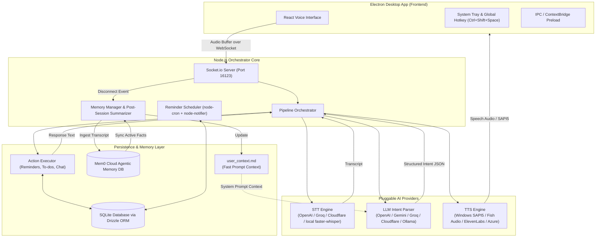

# Saira — System Architecture

**Saira** is a modular, voice-activated Windows desktop assistant designed with Electron, React, TypeScript, SQLite, Mem0 Agentic Memory, and a pluggable AI provider architecture (STT, LLM, TTS).

---

## 1. High-Level System Architecture



---

## 2. Core Subsystems

### A. Main Desktop Process & Window Management ([src/main/index.ts](file:///c:/Users/kapil/Desktop/space/saira-assistant/src/main/index.ts))
- **Tray & Global Hotkey**: Registers Windows System Tray icon and `Ctrl+Shift+Space` global shortcut to toggle the floating voice window.
- **IPC Isolation**: Uses Electron `contextBridge` ([src/main/preload.ts](file:///c:/Users/kapil/Desktop/space/saira-assistant/src/main/preload.ts)) to separate secure native Node APIs from the web renderer.

### B. Voice Interface & Renderer ([src/renderer/index.tsx](file:///c:/Users/kapil/Desktop/space/saira-assistant/src/renderer/index.tsx))
- **Audio Capture**: Utilizes browser `navigator.mediaDevices.getUserMedia` and `MediaRecorder` API to record voice input into WAV chunks.
- **WebSocket Streaming**: Streams binary audio data over Socket.io to the orchestrator.

### C. Pipeline Orchestrator ([src/orchestrator/index.ts](file:///c:/Users/kapil/Desktop/space/saira-assistant/src/orchestrator/index.ts))
The central engine that manages the end-to-end pipeline execution:
1. Receives audio buffer from socket.
2. Invokes **STT** provider to convert audio into text (`transcribe`).
3. Passes transcript to **LLM** provider to parse into structured intent (`parseIntent`).
4. Executes the intent via **Action Executor** (`executeIntent`).
5. Invokes **TTS** provider to synthesize speech output (`speak`).
6. Buffers conversation turns in memory for post-session memory consolidation.

### D. Pluggable Providers ([src/providers/](file:///c:/Users/kapil/Desktop/space/saira-assistant/src/providers))
Each AI task is decoupled into independent provider interfaces with automatic fallback:

| Provider Type | Supported Engines | Automatic Fallback |
|---|---|---|
| **Speech-to-Text (STT)** | OpenAI Whisper, Groq Whisper, Cloudflare Workers AI (`@cf/openai/whisper`), local `faster-whisper` | Local `faster-whisper` server |
| **Intent Model (LLM)** | OpenAI (`gpt-4o-mini`), Google Gemini, Groq (Llama), Cloudflare Workers AI (`@cf/meta/llama-3.1-8b-instruct`), Ollama | Local Ollama (`llama3.1`) |
| **Text-to-Speech (TTS)** | Windows SAPI5 (offline native), Fish Audio (`https://api.fish.audio/v1/tts`), ElevenLabs, Cloudflare Workers AI (`elevenlabs/eleven-multilingual-v2`), Azure Neural TTS | Windows SAPI5 (Powershell `System.Speech`) |

### E. Agentic Memory & Persistence ([src/memory/](file:///c:/Users/kapil/Desktop/space/saira-assistant/src/memory))
- **Mem0 Agentic Memory DB**: Cloud-backed AI memory engine (`api.mem0.ai`) for dynamic memory extraction, graph deduplication, and conflict resolution.
- **Local Context Cache ([`user_context.md`](file:///c:/Users/kapil/Desktop/space/saira-assistant/user_context.md))**: Fast startup knowledge base loaded directly into LLM prompts (0ms turn latency).
- **Post-Session Memory Summarizer ([`src/memory/summarizer.ts`](file:///c:/Users/kapil/Desktop/space/saira-assistant/src/memory/summarizer.ts))**: Asynchronous post-session worker that pushes transcripts to Mem0 and syncs active memories back to `user_context.md`.

### F. Action Executor & Storage ([src/actions/](file:///c:/Users/kapil/Desktop/space/saira-assistant/src/actions) & [src/db/](file:///c:/Users/kapil/Desktop/space/saira-assistant/src/db))
- **Action Executor**: Takes validated intent JSON (e.g. `reminder.create`, `todo.create`, `chat.respond`) and performs the underlying operations.
- **Database**: Local SQLite database using `better-sqlite3` and `drizzle-orm` storing `reminders` and `todos` tables.

### G. Background Scheduler ([src/orchestrator/scheduler.ts](file:///c:/Users/kapil/Desktop/space/saira-assistant/src/orchestrator/scheduler.ts))
- Runs background cron jobs to check for due reminders in SQLite.
- Triggers native Windows desktop notifications via `node-notifier` and speaks alert text via TTS.

---

## 3. End-to-End Voice & Memory Request Sequence

```mermaid
sequenceDiagram
    autonumber
    actor User
    participant Renderer as React Renderer
    participant Orch as Node Orchestrator
    participant STT as STT Provider
    participant LLM as LLM Provider
    participant Exec as Action Executor
    participant DB as SQLite DB
    participant TTS as TTS Provider
    participant Mem0 as Mem0 Agentic DB
    participant Context as user_context.md

    Note over User, Context: Phase 1: Voice Request Execution
    User->>Renderer: Click mic / Speak command
    Renderer->>Orch: socket.emit('audio', wavBuffer)
    Orch->>STT: transcribe(wavBuffer)
    STT-->>Orch: { text: "Remind me to call Mom tomorrow at 10am" }
    Orch->>Renderer: socket.emit('transcript', { text })
    Context-. Injected Context .->LLM
    Orch->>LLM: parseIntent(text)
    LLM-->>Orch: { intent: "reminder.create", params: { text: "call Mom", due: "..." } }
    Orch->>Exec: executeIntent(intent)
    Exec->>DB: INSERT INTO reminders ...
    DB-->>Exec: Created ID
    Exec-->>Orch: { spoken: "Reminder set for 10am: call Mom", display: "..." }
    Orch->>Renderer: socket.emit('response', response)
    Orch->>TTS: speak("Reminder set for 10am: call Mom")
    TTS-->>User: Audio playback (SAPI5 / ElevenLabs)

    Note over User, Context: Phase 2: Post-Session Memory Consolidation
    Renderer->>Orch: socket.on('disconnect')
    Orch->>Mem0: POST /v1/memories/ (Session transcript)
    Mem0-->>Orch: Memory processing queued
    Orch->>Mem0: GET /v1/memories/?user_id=saira_user
    Mem0-->>Orch: Active facts list
    Orch->>Context: Write updated user_context.md
```

---

## 4. Directory Map

```text
saira-assistant/
├── assets/                  # App icons and media assets
├── user_context.md          # Local cached user knowledge base for LLM prompts
├── src/
│   ├── actions/             # Business logic handlers for intents (reminders, todos, chat)
│   ├── db/                  # SQLite schema definitions and Drizzle ORM operations
│   ├── main/                # Electron main process (tray, windows, shortcuts, IPC preload)
│   ├── memory/              # Mem0 Agentic Memory client, context loader & post-session summarizer
│   ├── orchestrator/        # Socket.io pipeline coordinator & cron scheduler
│   ├── providers/           # Decoupled STT, LLM, and TTS provider implementations
│   ├── renderer/            # React user interface components & audio recording hook
│   └── shared/              # Zod config validation, types, and HTTP helpers
├── index.html               # Main HTML entry template
├── tsup.config.ts           # Dual-target build configuration (Node main + Browser IIFE)
└── package.json             # NPM dependencies and scripts
```

---

## 5. Step-by-Step Pipeline Latency Breakdown

The voice pipeline executes in a modular, streaming sequence. Below is the latency benchmark breakdown for each component step:

| Pipeline Step | Provider / Component | Expected Latency | Description |
|---|---|---|---|
| **1. Voice Activity & Pause Detection (VAD)** | Client AudioWorklet / ScriptProcessor | **0ms – 4,000ms** | Detects vocal energy RMS (`> 0.015`). Automatically triggers auto-send to LLM after **4 seconds of continuous silence** following speech. |
| **2. Client Audio Encoding (PCM to WAV)** | Renderer [`encodeWav`](file:///c:/Users/kapil/Desktop/space/saira-assistant/src/renderer/index.tsx) | **10ms – 30ms** | Packs Float32Array PCM chunks into 16kHz mono WAV audio buffer. |
| **3. IPC & Socket.io Transport** | Localhost Socket.io Bridge (Port 16123) | **2ms – 5ms** | Binary buffer transport from Electron renderer to Node.js orchestrator. |
| **4. Speech-to-Text (STT) Transcription** | Groq Whisper (`whisper-large-v3`) | **150ms – 300ms** | Fast cloud speech recognition. |
| | Cloudflare Workers AI (`@cf/openai/whisper`) | **300ms – 600ms** | Cloudflare Workers AI transcription. |
| | OpenAI Whisper (`whisper-1`) | **400ms – 800ms** | Standard OpenAI cloud transcription. |
| | Local `faster-whisper` Server | **200ms – 500ms** | Offline GPU/CPU Whisper server. |
| **5. Context Injection & LLM Intent Parsing** | Groq LLM (`llama3-8b-8192`) | **150ms – 350ms** | Injects global rules (`user_context.md`) and outputs structured Intent JSON. |
| | Google Gemini (`gemini-1.5-flash`) | **250ms – 500ms** | Gemini fast intent parsing. |
| | OpenAI (`gpt-4o-mini`) | **300ms – 600ms** | OpenAI fast intent parsing. |
| | Local Ollama (`llama3.1`) | **400ms – 1,000ms** | Fully offline local model intent extraction. |
| **6. Intent Action Execution & DB Storage** | SQLite (`better-sqlite3` + Drizzle) | **1ms – 5ms** | Instant local database CRUD query execution (reminders, to-dos, chat handler). |
| **7. Text-to-Speech (TTS) Synthesis** | Windows SAPI5 (Offline Native PowerShell) | **10ms – 30ms** | Immediate offline Windows native speech synthesis start. |
| | ElevenLabs / Fish Audio | **350ms – 700ms** | Cloud neural audio synthesis & MP3 streaming. |
| | Cloudflare Workers AI TTS | **300ms – 600ms** | Cloudflare neural speech synthesis. |
| **8. Audio Playback & Renderer Response Event** | Electron Window / Audio Engine | **2ms – 10ms** | Socket response payload emission and audio playback start. |

### End-to-End Latency Benchmarks (Silence Cutoff to Spoken Response)
- **Fastest Offline Configuration (Local STT + Local LLM + Windows SAPI5)**: **~350ms – 700ms total turn latency**
- **Optimal Cloud Configuration (Groq STT + Groq LLM + SAPI5 TTS)**: **~400ms – 800ms total turn latency**
- **Full Cloud Configuration (OpenAI STT + OpenAI LLM + ElevenLabs TTS)**: **~1.1s – 1.9s total turn latency**

